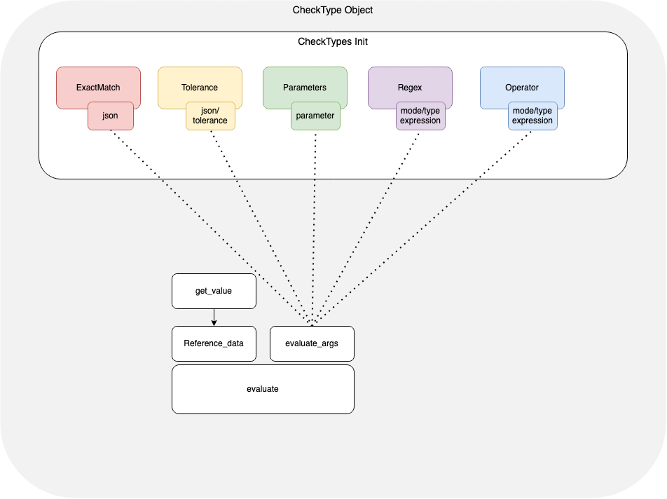

# netcompare

This library is meant to be a light-weight way to compare structured output from network devices `show` commands. `netcompare` is a python library targeted at intelligently deep diffing structured data objects of json type. In addition, `netcompare` can also provide some basic testing of key/values within a data structure.

The library heavily relies on [jmespath](https://jmespath.org/) for traversing the json object and finding the value(s) to be evaluated. More on that later.

## Use Case

`netcompare` enables an easy and direct way to see the outcome of network configuration or operational status change. The intended usage is to collect structured `show` command output before and after a change window. Prior to closing the change window, the results are compared to help determine if the change was successful as intended and if the network is in an acceptable state. The output can be stored with the change's documentation for easy reference and proof of completion.

## Library Architecture



An instance of `CheckType` object must be created first before passing one of the below check types as an argument:

- `exact_match`
- `tolerance`
- `parameters`
- `regex`
- `operator`


```python
my_check = "exact_match"
check = CheckType.init(my_check)
```

Next, define a json object as reference data, as well as a JMESPATH expression to extract the value wanted and pass them to `get_value` method. Be aware! `netcompare` works with a customized version of JMESPATH. More on that later.

```python
bgp_pre_change = "./pre/bgp.json"
bgp_jmspath_exp =  "result[0].vrfs.default.peerList[*].[$peerAddress$,establishedTransitions]"
pre_value = check.get_value(bgp_pre_change, bgp_jmspath_exp)
```

Once the pre-change values are extracted, we would need to evaluate it against our post-change value. In case of check-type `exact_match` our post-value would be another json object:

```python
bgp_post_change = "./post/bgp.json"
post_value = check.get_value(bgp_post_change, bgp_jmspath_exp)
```

Every check type expects different types of arguments. For example; check type, `tolerance` needs a `tolerance` argument; `parameters` expect only a dictionary.

Now that we have pre and post data, we just need to compare them with the `evaluate` method which will return our evaluation result.

```python
results = check.evaluate(post_value, pre_value, **evaluate_args)
```

## Customized JMESPATH

Since `netcompare` works with json objects as data inputs, JMESPATH was the obvious choice for traversing the data and extracting the value(s) to compare.

However, JMESPATH comes with a limitation where is not possible to define a `key` to which the `value` belongs to.

Below is the output of `show bgp`.

```json
{
  "result": [
    {
      "vrfs": {
        "default": {
          "peerList": [
            {
              "linkType": "external",
              "localAsn": "65130.1100",
              "prefixesSent": 50,
              "receivedUpdates": 0,
              "peerAddress": "7.7.7.7",
              "state": "Idle",
              "updownTime": 1394,
              "asn": "1.2354",
              "routerId": "0.0.0.0"
            },
            {
              "linkType": "external",
              "localAsn": "65130.1100",
              "receivedUpdates": 0,
              "peerAddress": "10.1.0.0",
              "state": "Connected",
              "updownTime": 1394,
              "asn": "1.2354",
              "routerId": "0.0.0.0"
            }
          ]
        }
      }
    }
  ]
}
```
A JMESPATH expression to extract `state` is shown below.

```python
"result[0].vrfs.default.peerList[*].state
```

...which will return

```python
["Idle", "Connected"]
```

How can we understand that `Idle` is relative to peer 7.7.7.7 and `Connected` to peer `10.1.0.0` ? 
We could index the output but that would require some post-processing of the data. For that reason, `netcompare` use a customized version of JMESPATH where it is possible to define a reference key for the value(s) wanted. The reference key must be within `$` sign anchors and defined in a list, together with the value(s):

```python
"result[0].vrfs.default.peerList[*].[$peerAddress$,state]
```

That  would give us...

```python
{"7.7.7.7": ["Idle"], "10.1.0.0": ["Connected"]}

```

## Check Types Explained

### exact_match

Check type `exact_match` is concerned about the value of the elements within the data structure. The keys and values should match between the pre and post values. A diff is generated between the two data sets. 
As some outputs might be too verbose or includes fields that constantly change (i.e. interface counter), is possible to exclude a portion of data traversed by JMSPATH, defining a list of keys that we want to exclude.

Examples:


```python
>>> from netcompare import CheckType
>>> pre_data = {
      "jsonrpc": "2.0",
      "id": "EapiExplorer-1",
      "result": [
        {
          "interfaces": {
            "Management1": {
              "lastStatusChangeTimestamp": 1626247820.0720868,
              "lanes": 0,
              "name": "Management1",
              "interfaceStatus": "connected",
              "autoNegotiate": "success",
              "burnedInAddress": "08:00:27:e6:b2:f8",
              "loopbackMode": "loopbackNone",
              "interfaceStatistics": {
                "inBitsRate": 3582.5323982177174,
                "inPktsRate": 3.972702352461616,
                "outBitsRate": 17327.65267220522,
                "updateInterval": 300,
                "outPktsRate": 2.216220664406746
              }
            }
          }
        }
      ]
    }
>>> post_data = {
      "jsonrpc": "2.0",
      "id": "EapiExplorer-1",
      "result": [
        {
          "interfaces": {
            "Management1": {
              "lastStatusChangeTimestamp": 1626247821.123456,
              "lanes": 0,
              "name": "Management1",
              "interfaceStatus": "down",
              "autoNegotiate": "success",
              "burnedInAddress": "08:00:27:e6:b2:f8",
              "loopbackMode": "loopbackNone",
              "interfaceStatistics": {
                "inBitsRate": 3403.4362520883615,
                "inPktsRate": 3.7424095978179257,
                "outBitsRate": 16249.69114419833,
                "updateInterval": 300,
                "outPktsRate": 2.1111866059750692
              }
            }
          }
        }
      ]
    }
>>> my_jmspath = "result[*]"
>>> exclude_fields = ["interfaceStatistics", "lastStatusChangeTimestamp"]
>>> # Create an instance of CheckType object with 'exact_match' as check-type argument.
>>> my_check = CheckType.init(check_type="exact_match")
>>> my_check
>>> <netcompare.check_types.ExactMatchType object at 0x10ac00f10>
>>> # Extract the wanted value from pre_dat to later compare with post_data. As we want compare all the body (excluding "interfaceStatistics"), we do not need to define any reference key
>>> pre_value = my_check.get_value(output=pre_data, path=my_jmspath, exclude=exclude_fields)
>>> pre_value
>>> [{'interfaces': {'Management1': {'lastStatusChangeTimestamp': 1626247820.0720868, 'lanes': 0, 'name': 'Management1', 'interfaceStatus': 'connected', 'autoNegotiate': 'success', 'burnedInAddress': '08:00:27:e6:b2:f8', 'loopbackMode': 'loopbackNone'}}}]
>>> post_value = my_check.get_value(output=post_data, path=my_jmspath, exclude=exclude_fields)
>>> post_value
>>> [{'interfaces': {'Management1': {'lastStatusChangeTimestamp': 1626247821.123456, 'lanes': 0, 'name': 'Management1', 'interfaceStatus': 'down', 'autoNegotiate': 'success', 'burnedInAddress': '08:00:27:e6:b2:f8', 'loopbackMode': 'loopbackNone'}}}]
>>> # The pre_value is our intended state for interface Management1, therefore we will use it as reference data. post_value will be our value_to_compare as we want compare the actual state of our interface Management1 (perhaps after a network maintenance) with the its status before the change.
>>> result = my_check.evaluate(value_to_compare=post_value, reference_data=pre_value)
>>> result
>>> ({'interfaces': {'Management1': {'interfaceStatus': {'new_value': 'down', 'old_value': 'connected'}}}}, False)
```

As we can see, we return a tuple containing a diff betwee the pre and post data as well as a boolean for the overall test result. In this case a diff has been found so the status of the test is `False`.

Let's see a better way to run `exact_match` for this specific case. Since we are interested only into `interfaceStatus` we could write our JMSPATH expression as:

```python
>>> my_jmspath = "result[*].interfaces.*.[$name$,interfaceStatus]"
>>> pre_value = my_check.get_value(output=pre_data, path=my_jmspath)
>>> pre_value
['connected']
>>> post_value = my_check.get_value(output=post_data, path=my_jmspath)
>>> post_value
['down']
>>> result = my_check.evaluate(value_to_compare=post_value, reference_data=pre_value)
>>> result
({"Management1": {"interfaceStatus": {"new_value": "connected", "old_value": "down"}}}, False)
```
Targeting only `interfaceStatus` key, we would need to define a reference key (in this case `$name$`) as well as we would not need to define any exclusion list. 

The anchor logic for reference key applies to all check-types available in `netcompare`


### parameter_match

parameter_match provides a way to match keys and values in the output with known good values. 

The test defines key/value pairs known to be the good value - type `dict()` - as well as a mode - `match`, `no-match` - to match or not against the parsed output. The test fails if any status has changed based on what is defined in pre/post. If there are new values not contained in the input/test value, that will not count as a failure.


Examples:

```python
>>> post_data = {
...       "jsonrpc": "2.0",
...       "id": "EapiExplorer-1",
...       "result": [
...         {
...           "interfaces": {
...             "Management1": {
...               "lastStatusChangeTimestamp": 1626247821.123456,
...               "lanes": 0,
...               "name": "Management1",
...               "interfaceStatus": "down",
...               "autoNegotiate": "success",
...               "burnedInAddress": "08:00:27:e6:b2:f8",
...               "loopbackMode": "loopbackNone",
...               "interfaceStatistics": {
...                 "inBitsRate": 3403.4362520883615,
...                 "inPktsRate": 3.7424095978179257,
...                 "outBitsRate": 16249.69114419833,
...                 "updateInterval": 300,
...                 "outPktsRate": 2.1111866059750692
...               }
...             }
...           }
...         }
...       ]
>>> my_check = CheckType.init(check_type="parameter_match")
>>> my_jmspath = "result[*].interfaces.*.[$name$,interfaceStatus,autoNegotiate]"
>>> post_value = my_check.get_value(output=post_data, path=my_jmspath)
>>> # mode: match - Match in the ouptut what is defined under 'params'
>>> my_parameter_match = {"mode": "match", "params": {"interfaceStatus": "connected", "autoNegotiate": "success"}}
>>> actual_results = my_check.evaluate(post_value, **my_parameter_match)
>>> actual_results
({'Management1': {'interfaceStatus': 'down'}}, False)
>>> # mode: no-match - Return what does nto match in the ouptut as defined under 'params'
>>> my_parameter_match = {"mode": "no-match", "params": {"interfaceStatus": "connected", "autoNegotiate": "success"}}
>>> actual_results = my_check.evaluate(post_value, **my_parameter_match)
>>> actual_results
({'Management1': {'autoNegotiate': 'success'}}, False
```

In network data, this could be a state of bgp neighbors being Established or the connectedness of certain interfaces being up.

### Tolerance

The `tolerance` test defines a percentage of differing `float()` between pre and post checks numeric value. The threshold is defined as a percentage that can be different either from the value stated in pre and post fields. 

The threshold must be `float > 0`, is percentge based, and will be counted as a range centered on the value in pre and post.

Lets have a look to a couple of examples:

```python
>>> pre_data = {
...     "global": {
...         "peers": {
...             "10.1.0.0": {
...                 "address_family": {
...                     "ipv4": {
...                         "accepted_prefixes": 900,
...                         "received_prefixes": 999,
...                         "sent_prefixes": 1011
...                     },
...                     "ipv6": {
...                         "accepted_prefixes": 1000,
...                         "received_prefixes": 1000,
...                         "sent_prefixes": 1000
...                     }
...                 },
...                 "description": "",
...                 "is_enabled": True,
...                 "is_up": True,
...                 "local_as": 4268360780,
...                 "remote_as": 67890,
...                 "remote_id": "0.0.0.0",
...                 "uptime": 1783
...             }
...         }
...     }
... }
>>> post_data = {
...     "global": {
...         "peers": {
...             "10.1.0.0": {
...                 "address_family": {
...                     "ipv4": {
...                         "accepted_prefixes": 500,
...                         "received_prefixes": 599,
...                         "sent_prefixes": 511
...                     },
...                     "ipv6": {
...                         "accepted_prefixes": 1000,
...                         "received_prefixes": 1000,
...                         "sent_prefixes": 1000
...                     }
...                 },
...                 "description": "",
...                 "is_enabled": True,
...                 "is_up": True,
...                 "local_as": 4268360780,
...                 "remote_as": 67890,
...                 "remote_id": "0.0.0.0",
...                 "uptime": 1783
...             }
...         }
...     }
... }
>>> my_check = CheckType.init(check_type="tolerance")
>>> my_jmspath = "global.$peers$.*.*.ipv4.[accepted_prefixes,received_prefixes,sent_prefixes]"
>>> # Tolerance define as 10% delta between pre and post values
>>> my_tolerance_arguments = {"tolerance": 10}
>>> pre_value = my_check.get_value(pre_data, my_jmspath)
>>> post_value = my_check.get_value(post_data, my_jmspath)
>>> actual_results = my_check.evaluate(post_value, pre_value, **my_tolerance_arguments)
>>> # Netcompare returns the value that are not within the 10%
>>> actual_results
({'10.1.0.0': {'accepted_prefixes': {'new_value': 500, 'old_value': 900}, 'received_prefixes': {'new_value': 599, 'old_value': 999}, 'sent_prefixes': {'new_value': 511, 'old_value': 1011}}}, False)
>>> # Let's difine a higher tolerance 
>>> my_tolerance_arguments = {"tolerance": 80}
>>> # In this case, all the values are within the 80% so the check is passed.
>>> actual_results = my_check.evaluate(post_value, pre_value, **my_tolerance_arguments)
>>> actual_results
({}, True)
```

This test can test the tolerance for changing quantities of certain things such as routes, or L2 or L3 neighbors. It could also test actual outputted values such as transmitted light levels for optics.


### Regex

The `regex` check type evaluates data against a python regular expression defined as check-type argument. As per `parameter_match` the option `match`, `no-match` is also supported.

Let's run an example where we want to check the `burnedInAddress` key has a string representing a MAC Address as value

```python
>>> data = {
...       "jsonrpc": "2.0",
...       "id": "EapiExplorer-1",
...       "result": [
...         {
...           "interfaces": {
...             "Management1": {
...               "lastStatusChangeTimestamp": 1626247821.123456,
...               "lanes": 0,
...               "name": "Management1",
...               "interfaceStatus": "down",
...               "autoNegotiate": "success",
...               "burnedInAddress": "08:00:27:e6:b2:f8",
...               "loopbackMode": "loopbackNone",
...               "interfaceStatistics": {
...                 "inBitsRate": 3403.4362520883615,
...                 "inPktsRate": 3.7424095978179257,
...                 "outBitsRate": 16249.69114419833,
...                 "updateInterval": 300,
...                 "outPktsRate": 2.1111866059750692
...               }
...             }
...           }
...         }
...       ]
...     }
>>> # Python regex for matching MAC Address string
>>> regex_args = {"regex": "(?:[0-9a-fA-F]:?){12}", "mode": "match"}
>>> path = "result[*].interfaces.*.[$name$,burnedInAddress]"
>>> check = CheckType.init(check_type="regex")
>>> value = check.get_value(output=data, path=path)
>>> value
[{'Management1': {'burnedInAddress': '08:00:27:e6:b2:f8'}}]
>>> result = check.evaluate(value, **regex_args)
>>> # The test is passed as the burnedInAddress value match our regex
>>> result
({}, True)
>>> # What if we want "no-match"?
>>> regex_args = {"regex": "(?:[0-9a-fA-F]:?){12}", "mode": "no-match"}
>>> result = check.evaluate(value, **regex_args)
>>> # Netcompare return the failing data as the regex match the value
>>> result
({'Management1': {'burnedInAddress': '08:00:27:e6:b2:f8'}}, False)
```

### Operator

Operator is a check which includes an array of different evaluation logic. Here a summary of the available options:


#### `in` operators


    1. is-in: Check if the specified element string value is included in a given list of strings.
          - is-in: ["down", "up"] 
            check if value is in list (down, up)  

    2. not-in: Check if the specified element string value is NOT included in a given list of strings.
           - not-in: ["down", "up"] 
             check if value is not in list (down, up) 

    3. in-range: Check if the value of a specified element is in the given numeric range.
            - in-range: [20, 70]
              check if value is in range between 20 nad 70 

    4. not-range: Check if the value of a specified element is outside of a given numeric range.
              - not-range: [5 , 40]
                checks if value is not in range between 5 and 40

#### `bool` operators

    1. all-same: Check if all content values for the specified element are the same. It can also be used to compare all content values against another specified element.
           - all-same: flap-count
             checks if all values of node <flap-count> in given path is same or not.

#### `str` operators

    1. contains: determines if an element string value contains the provided test-string value.
           - contains: "underlay"
           checks if "underlay" is present in given data or not. 

    2. not-contains: determines if an element string value does not contain the provided test-string value.
           - not-contains: "overlay"
           checks if "overlay" is present in given node or not.

#### `int`, `float` operators

    1. is-gt: Check if the value of a specified element is greater than a given numeric value.
            - is-gt: 2
              checks if value should be greater than 2  

    2. is-lt: Check if the value of a specified element is lesser than a given numeric value.
            - is-lt: 55
              checks if value is lower than 55 or not.  


Examples:

```python
>>> data = {
...     "jsonrpc": "2.0",
...     "id": "EapiExplorer-1",
...     "result": [
...       {
...         "vrfs": {
...           "default": {
...             "peerList": [
...               {
...                 "linkType": "external",
...                 "localAsn": "65130.1100",
...                 "peerAddress": "7.7.7.7",
...                 "lastEvent": "NoEvent",
...                 "bgpSoftReconfigInbound": "Default",
...                 "state": "Connected",
...                 "asn": "1.2354",
...                 "routerId": "0.0.0.0",
...                 "prefixesReceived": 101,
...                 "maintenance": False,
...                 "autoLocalAddress": "disabled",
...                 "lastState": "NoState",
...                 "establishFailHint": "Peer is not activated in any address-family mode",
...                 "maxTtlHops": None,
...                 "vrf": "default",
...                 "peerGroup": "EVPN-OVERLAY-SPINE",
...                 "idleReason": "Peer is not activated in any address-family mode",
...               },
...               {
...                 "linkType": "external",
...                 "localAsn": "65130.1100",
...                 "peerAddress": "10.1.0.0",
...                 "lastEvent": "Stop",
...                 "bgpSoftReconfigInbound": "Default",
...                 "state": "Idle",
...                 "asn": "1.2354",
...                 "routerId": "0.0.0.0",
...                 "prefixesReceived": 50,
...                 "maintenance": False,
...                 "autoLocalAddress": "disabled",
...                 "lastState": "Active",
...                 "establishFailHint": "Could not find interface for peer",
...                 "vrf": "default",
...                 "peerGroup": "IPv4-UNDERLAY-SPINE",
...                 "idleReason": "Could not find interface for peer",
...                 "localRouterId": "1.1.0.1",
...               }
...             ]
...           }
...         }
...       }
...     ]
...   }
>>> path = "result[0].vrfs.default.peerList[*].[$peerAddress$,peerGroup,vrf,state]"
>>> # "operator" checks requires "mode" argument - which specify the operator logic to apply - 
>>> # and "operator_data" required for the mode defined.
>>> check_args = {"params": {"mode": "all-same", "operator_data": True}}
>>> check = CheckType.init("operator")
>>> value = check.get_value(data, path)
>>> value
[{'7.7.7.7': {'peerGroup': 'EVPN-OVERLAY-SPINE', 'vrf': 'default', 'state': 'Connected'}}, {'10.1.0.0': {'peerGroup': 'IPv4-UNDERLAY-SPINE', 'vrf': 'default', 'state': 'Idle'}}]
>>> result = check.evaluate(value, check_args)
>>> # We are looking for peers that have the same peerGroup,vrf and state. If not, return those are not. 
>>> result
((False, [{'7.7.7.7': {'peerGroup': 'EVPN-OVERLAY-SPINE', 'vrf': 'default', 'state': 'Connected'}}, {'10.1.0.0': {'peerGroup': 'IPv4-UNDERLAY-SPINE', 'vrf': 'default', 'state': 'Idle'}}]), False)
```

Let's now look to an example for the `in` operator. Keeping the same `data` and class object as above:

```python
>>> check_args = {"params": {"mode": "is-in", "operator_data": [20, 40, 50]}}
>>> path = "result[0].vrfs.default.peerList[*].[$peerAddress$,prefixesReceived]"
>>> value = check.get_value(data, path)
>>> value
[{'7.7.7.7': {'prefixesReceived': 101}}, {'10.1.0.0': {'prefixesReceived': 50}}]
>>> # We are looking for prefixesReceived value in operator_data list.
>>> result = check.evaluate(value, check_args)
>>> result
((True, [{'10.1.0.0': {'prefixesReceived': 50}}]), False)
```

What about `str` operator?

```python
>>> path = "result[0].vrfs.default.peerList[*].[$peerAddress$,peerGroup]"
>>> check_args = {"params": {"mode": "contains", "operator_data": "EVPN"}}
>>> value = check.get_value(data, path)
>>> value
[{'7.7.7.7': {'peerGroup': 'EVPN-OVERLAY-SPINE'}}, {'10.1.0.0': {'peerGroup': 'IPv4-UNDERLAY-SPINE'}}]
>>> result = check.evaluate(value, check_args)
>>> result
((True, [{'7.7.7.7': {'peerGroup': 'EVPN-OVERLAY-SPINE'}}]), False)
```

Can you guess what would ne the outcome for an `int`, `float` operator?

```python
>>> path = "result[0].vrfs.default.peerList[*].[$peerAddress$,prefixesReceived]"
>>> check_args = {"params": {"mode": "is-gt", "operator_data": 20}}
>>> value = check.get_value(data, path)
>>> value
[{'7.7.7.7': {'prefixesReceived': 101}}, {'10.1.0.0': {'prefixesReceived': 50}}]
>>> result = check.evaluate(value, check_args)
>>> result
((True, [{'7.7.7.7': {'prefixesReceived': 101}}, {'10.1.0.0': {'prefixesReceived': 50}}]), False)
```

See [test](./tests) folder for more examples.

