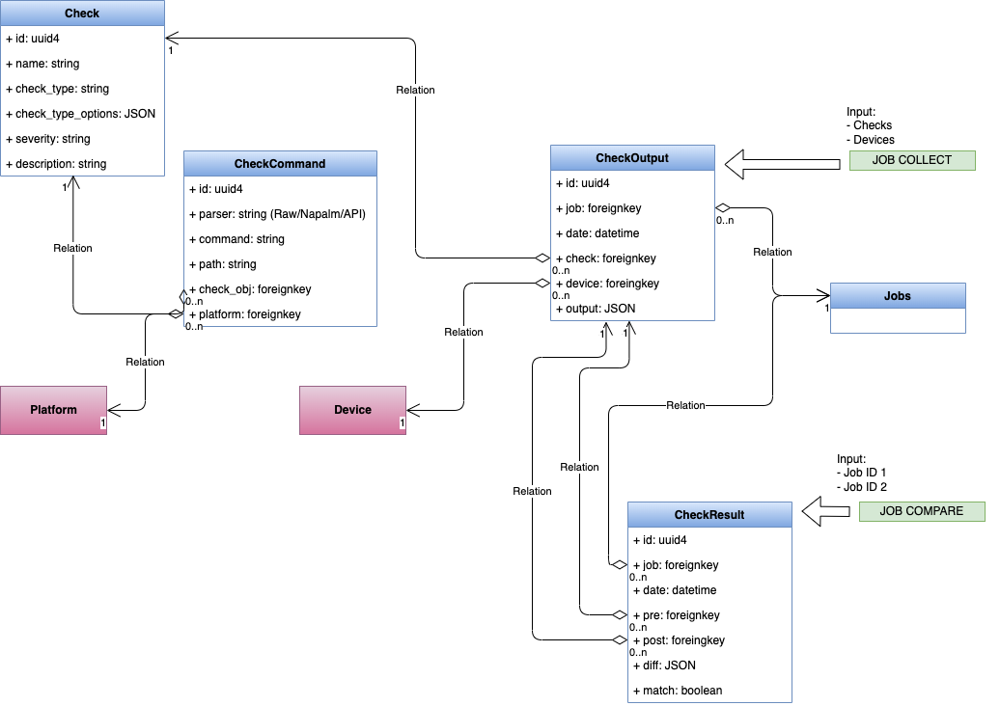

# jdiff

`jdiff` is a lightweight Python library allowing you to examine structured data. `jdiff` provides an interface to intelligently compare JSON data objects and test for the presence (or absence) of keys. You can also examine and compare corresponding key values.

The library heavily relies on [JMESPath](https://jmespath.org/) for traversing the JSON object and finding the values to be evaluated. More on that [here](#customized-jmespath).

## Use cases

`jdiff` has been developed around diffing and testing structured data returned from APIs and other python modules and libraries (such as TextFSM). The primary use case is structured data returned from networking devices, but we found the use case can apply to any structured data and is especially useful when working or dealing with structured data from APIs. 

### Use Case 1 
### Use Case 2
### Use Case 3

## Usage

A `jdiff` Check accepts two Python dictionaries as input: the reference object and the comparison object. The reference object is used as the intended or accepted state and it's keys and values are compared against the comparison object. The comparison is done through a 'CheckType' object, which are further explained below. Additionally, `jdiff` is focused on the comparison of the two objects and the testing of the values, not retrieving the data.

### Getting started

TODO: Write getting started guide in docs and link here.

First you import the CheckType class.

```python
from jdiff import CheckType
```

Get (or fabricate) some data (this data may also be loaded from a file or from a string, more examples later).

```python
a = {"foo": "bar"}
b = {"foo": "barbar"}
```

Using the CheckType class, call the create method to create an instance of the type of check you will perform.

```python
match = CheckType.create("exact_match")
```

Evaluate the check type and the diff.
```python
match.evaluate(a, b)
>>> ({'foo': {'new_value': 'barbar', 'old_value': 'bar'}}, False)
```

This results in a tuple:
- The first value is the diff between the two dictionaries
- The second value is a boolean with the result of the Check

This diff can also show new or deleted keys if they exist. 
The second value returned will be the boolean result of the Check. In this case, the two dictionaries were not an exact match.

| Stephen - we may want to remove these next two paragraphs
For instance, the reference state can be collected from the network directly using any method that returns structured data: Ansible, NAPALM, Nornir to name a few. You could also choose to generate the reference state from an SoT, such as [Nautobot](https://github.com/nautobot/nautobot/), and have a true intended state.

`jdiff` is perfectly suited to work with data gathered from network devices via show commands, Ansible playbooks, as well as in applications such as [Nautobot](https://github.com/nautobot/nautobot/), or [Netbox](https://github.com/netbox-community/netbox). `jdiff` is focused on being the 'plumbing' behind a full network automation validation solution. 
### Checking data structures

As shown in the example, the Check evaluation both performs a diff and tests the objects. All of the CheckTypes both perform the diff and their specified check.

More on the 'check' part: the check provides a way to 'test' some keys or values in our collected data. The check portion is focused on providing a boolean result from the check. There are a few different ways to check our data. 

These are the different checks that can be performed on the data. These both describe the type of check and are also used as the argument to instantiate that type of check with the create method: `CheckType.create("check_type")`.

- `exact_match`: the keys and values much match, exactly, between the two objects
- `tolerance`: the keys must match and the values can differ according to the 'tolerance' value provided
- `parameter_match`: a reference key and value is provided and its presence (or absence) is checked in the provided object
- `regex`: a reference regex pattern is provided which is used to find a match in the provided object
- `operator`: similar to parameter match, but the reference includes several different possible operators: 'in', 'bool', 'string', and numerical comparison with 'int' and 'float' to check against

`CheckTypes` are explained in more detail in the [CheckTypes Explained section](#check-types-explained).


## Workflow

|  |
|:---:|
| **`jdiff` workflow** |

| Przemek: I think this diagram would work better if it were wide, rather than tall. Netcompare name should match the name we choose for this library (e.g. Netcompare instead of NETCOMPARE). The individual Netcompare components are difficult to read in the vertical orientation.


1. The reference state object is retrieved or assembled. The structured data may be from:

    - an API
    - another python module/library
    - retrieved from a saved file
    - constructed 

2. Some time passes where some change to the data may occurr
3. The comparison state is retrieved or assembled, in many cases, utilizing a similar process used to get the reference state
4. The reference state is then compared to the current state using the jdiff library.

## Library Architecture

|  |
|:---:|
| **`jdiff` architecture** |

We use the `CheckType` factory class method `create` along with the specified checktype to instantiate a concrete class of the specified CheckType.

```python
CheckType.create("exact_match")
>>> <jdiff.check_types.ExactMatchType at 0x10a618e80>
```

- `exact_match`
- `tolerance`
- `parameter_match`
- `regex`
- `operator`

| Przemek: Perhaps create a table showing how each of the arguments maps to a concrete class?

| Stephen - This step may not be necessary at all? I would say this may come with more advanced use cases. Note: the extract data from json is specifically for getting keys and values from larger dictionaries to make it easier to compare and check specific parts/branches of the object. 

Next, define a json object as reference data, as well as a JMESPATH expression to extract the value wanted and pass them to `extract_data_from_json` method. Be aware! `jdiff` works with a customized version of JMESPATH. More on that [below](#customized-jmespath).

```python
bgp_reference_state = "./pre/bgp.json"
bgp_jmspath_exp =  "result[0].vrfs.default.peerList[*].[$peerAddress$,establishedTransitions]"
bgp_reference_value = check.extract_data_from_json(bgp_reference_state, bgp_jmspath_exp)
```

| Przemek: Does the JSON object have to be on the disk? Can it be an in-memory object? Does it have to a JSON object at all? Can it be a dictionary, or a dictionary-like object?

Once the pre-change values are extracted, we would need to evaluate it against our post-change value. In case of check-type `exact_match` our post-value would be another json object:

```python
bgp_comparison_state = "./post/bgp.json"
bgp_comparison_value = check.extract_data_from_json(bgp_post_change, bgp_jmspath_exp)
```

Each check type expects different types of arguments based on how and what they are checking. For example: check type `tolerance` needs a `tolerance` argument, Whereas `parameters` expects a dictionary.

Now that we have pre and post data, we use `evaluate` method to compare them which will return our evaluation result.

```python
results = check.evaluate(post_value, pre_value, **evaluate_args)
```

## Customized JMESPath

Since `jdiff` works with json objects as data inputs, JMESPATH was the obvious choice for traversing the data and extracting the value(s) to compare. However, JMESPath comes with a limitation where it is not possible to define a `key` to which the `value` belongs to, losing the context of the returned values.

| Przemek: `key` and `value` are confusing here. This implies parent-child relationship but the example shows two keys, and their values, at the same level of hierarchy. I think something along the lines of "define relationship between two keys and their values" would work better.

| Stephen: I've lost some context to the above comment. Is this point made more clear with what is here now?

Below is the output of `show bgp`.

```json
{
  "result": [
    {
      "vrfs": {
        "default": {
          "peerList": [
            {
              "linkType": "external",
              "localAsn": "65130.1100",
              "prefixesSent": 50,
              "receivedUpdates": 0,
              "peerAddress": "7.7.7.7",
              "state": "Idle",
              "updownTime": 1394,
              "asn": "1.2354",
              "routerId": "0.0.0.0"
            },
            {
              "linkType": "external",
              "localAsn": "65130.1100",
              "receivedUpdates": 0,
              "peerAddress": "10.1.0.0",
              "state": "Connected",
              "updownTime": 1394,
              "asn": "1.2354",
              "routerId": "0.0.0.0"
            }
          ]
        }
      }
    }
  ]
}
```
A JMESPath expression to extract `state` is shown below.

```python
"result[0].vrfs.default.peerList[*].state
```

...which will return

```python
["Idle", "Connected"]
```

How can we understand that `Idle` is relative to peer 7.7.7.7 and `Connected` to peer `10.1.0.0` ? 
We could index the output but that would require some post-processing of the data. For that reason, `jdiff` use a customized version of JMESPATH where it is possible to define a reference key for the value(s) wanted. The reference key must be within `$` sign anchors and defined in a list, together with the value(s):

```python
"result[0].vrfs.default.peerList[*].[$peerAddress$,state]
```

That  would give us...

```python
{"7.7.7.7": ["Idle"], "10.1.0.0": ["Connected"]}

```


## `CheckTypes` Explained

### exact_match

Check type `exact_match` is concerned about the value of the elements within the data structure. The key/values should match between the reference and comparison values. A diff is generated between the two data sets.
As some outputs might be too verbose or include fields that constantly change (i.e. interface counter), it is possible to exclude a portion of data traversed by JMESPath by defining a list of keys that we want to exclude.

| Przemek: `extract_data_from_json` is used without prior introduction. At this stage I'm not sure where this comes from, what it does, and what arguments does it accept.


Examples:


```python
>>> from jdiff import CheckType
>>> reference = {

      "jsonrpc": "2.0",
      "id": "EapiExplorer-1",
      "result": [
        {
          "interfaces": {
            "Management1": {
              "lastStatusChangeTimestamp": 1626247820.0720868,
              "lanes": 0,
              "name": "Management1",
              "interfaceStatus": "connected",
              "autoNegotiate": "success",
              "burnedInAddress": "08:00:27:e6:b2:f8",
              "loopbackMode": "loopbackNone",
              "interfaceStatistics": {
                "inBitsRate": 3582.5323982177174,
                "inPktsRate": 3.972702352461616,
                "outBitsRate": 17327.65267220522,
                "updateInterval": 300,
                "outPktsRate": 2.216220664406746
              }
            }
          }
        }
      ]
    }
>>> comparison = {
      "jsonrpc": "2.0",
      "id": "EapiExplorer-1",
      "result": [
        {
          "interfaces": {
            "Management1": {
              "lastStatusChangeTimestamp": 1626247821.123456,
              "lanes": 0,
              "name": "Management1",
              "interfaceStatus": "down",
              "autoNegotiate": "success",
              "burnedInAddress": "08:00:27:e6:b2:f8",
              "loopbackMode": "loopbackNone",
              "interfaceStatistics": {
                "inBitsRate": 3403.4362520883615,
                "inPktsRate": 3.7424095978179257,
                "outBitsRate": 16249.69114419833,
                "updateInterval": 300,
                "outPktsRate": 2.1111866059750692
              }
            }
          }
        }
      ]
    }
>>> my_jmspath = "result[*]"
>>> exclude_fields = ["interfaceStatistics", "lastStatusChangeTimestamp"]
>>> # Create an instance of CheckType object with 'exact_match' as check-type argument.
>>> my_check = CheckType.create(check_type="exact_match")
>>> my_check
>>> <jdiff.check_types.ExactMatchType object at 0x10ac00f10>
>>> # Extract the wanted value from pre_dat to later compare with post_data. As we want compare all the body (excluding "interfaceStatistics"), we do not need to define any reference key
>>> pre_value = extract_data_from_json(output=reference, path=my_jmspath, exclude=exclude_fields)
>>> pre_value
>>> [{'interfaces': {'Management1': {'lastStatusChangeTimestamp': 1626247820.0720868, 'lanes': 0, 'name': 'Management1', 'interfaceStatus': 'connected', 'autoNegotiate': 'success', 'burnedInAddress': '08:00:27:e6:b2:f8', 'loopbackMode': 'loopbackNone'}}}]
>>> post_value = extract_data_from_json(output=reference, path=my_jmspath, exclude=exclude_fields)
>>> post_value
>>> [{'interfaces': {'Management1': {'lastStatusChangeTimestamp': 1626247821.123456, 'lanes': 0, 'name': 'Management1', 'interfaceStatus': 'down', 'autoNegotiate': 'success', 'burnedInAddress': '08:00:27:e6:b2:f8', 'loopbackMode': 'loopbackNone'}}}]
>>> # The pre_value is our intended state for interface Management1, therefore we will use it as reference data. post_value will be our value_to_compare as we want compare the actual state of our interface Management1 (perhaps after a network maintenance) with the its status before the change.
>>> result = my_check.evaluate(reference, comparison)
>>> result
>>> ({'interfaces': {'Management1': {'interfaceStatus': {'new_value': 'down', 'old_value': 'connected'}}}}, False)
```

| Przemek: Why is the argument to `extract_data_from_json` named `output` ? We are passing data structure to it, so perhaps `input` or `data`?


As we can see, we return a tuple containing a diff between the pre and post data as well as a boolean for the overall test result. In this case a difference has been found so the status of the test is `False`.

Let's see a better way to run `exact_match` for this specific case. Since we are interested in `interfaceStatus` only we could write our JMESPath expression as:

```python
>>> my_jmspath = "result[*].interfaces.*.[$name$,interfaceStatus]"
>>> pre_value = extract_data_from_json(output=pre_data, path=my_jmspath)
>>> pre_value
['connected']
>>> post_value = extract_data_from_json(output=post_data, path=my_jmspath)
>>> post_value
['down']
>>> result = my_check.evaluate(value_to_compare=post_value, reference_data=pre_value)
>>> result
({"Management1": {"interfaceStatus": {"new_value": "connected", "old_value": "down"}}}, False)
```

| Przemek: The above example doesn't seem to match the latest version of the library, see my test below:

```
>>> my_check = CheckType.create(check_type="exact_match")
>>> my_jmspath = "result[*].interfaces.*.[$name$,interfaceStatus]"
>>> pre_value = extract_data_from_json(output=pre_data, path=my_jmspath)
>>> pre_value
[{'Management1': {'interfaceStatus': 'connected'}}]
>>> post_value = extract_data_from_json(output=post_data, path=my_jmspath)
>>> post_value
[{'Management1': {'interfaceStatus': 'down'}}]
>>> result = my_check.evaluate(value_to_compare=post_value, reference_data=pre_value)
>>> result
({'Management1': {'interfaceStatus': {'new_value': 'down', 'old_value': 'connected'}}}, False)
```

Targeting only the `interfaceStatus` key, we would need to define a reference key (in this case `$name$`), we would not define any exclusion list. 

The anchor logic for the reference key applies to all check-types available in `jdiff`

| Przemek: What is "anchor logic"?

### Tolerance

The `tolerance` test defines a percentage deviation (of type `float()`) between reference and comparison values' numeric value. The `tolerance` is defined as a percentage that can be different between the reference and comparison values.

| Przemek: This doesn't read very well. What does the `tolerance` check tests for? Looking at source code it seems we're checking if the deviation(variation) between the actual and expected value is within the percentage tolerance.

The `tolerance` must be a `float > 0`. The calculation is percentage based, and the test of the values may be +/- the `tolerance` percentage.

Let's have a look at a couple of examples:

```python
>>> pre_data = {
...     "global": {
...         "peers": {
...             "10.1.0.0": {
...                 "address_family": {
...                     "ipv4": {
...                         "accepted_prefixes": 900,
...                         "received_prefixes": 999,
...                         "sent_prefixes": 1011
...                     },
...                     "ipv6": {
...                         "accepted_prefixes": 1000,
...                         "received_prefixes": 1000,
...                         "sent_prefixes": 1000
...                     }
...                 },
...                 "description": "",
...                 "is_enabled": True,
...                 "is_up": True,
...                 "local_as": 4268360780,
...                 "remote_as": 67890,
...                 "remote_id": "0.0.0.0",
...                 "uptime": 1783
...             }
...         }
...     }
... }
>>> post_data = {
...     "global": {
...         "peers": {
...             "10.1.0.0": {
...                 "address_family": {
...                     "ipv4": {
...                         "accepted_prefixes": 500,
...                         "received_prefixes": 599,
...                         "sent_prefixes": 511
...                     },
...                     "ipv6": {
...                         "accepted_prefixes": 1000,
...                         "received_prefixes": 1000,
...                         "sent_prefixes": 1000
...                     }
...                 },
...                 "description": "",
...                 "is_enabled": True,
...                 "is_up": True,
...                 "local_as": 4268360780,
...                 "remote_as": 67890,
...                 "remote_id": "0.0.0.0",
...                 "uptime": 1783
...             }
...         }
...     }
... }
>>> my_check = CheckType.create(check_type="tolerance")
>>> my_jmspath = "global.$peers$.*.*.ipv4.[accepted_prefixes,received_prefixes,sent_prefixes]"
>>> # Tolerance define as 10% delta between pre and post values
>>> my_tolerance_arguments = {"tolerance": 10}
>>> pre_value = extract_data_from_json(pre_data, my_jmspath)
>>> post_value = extract_data_from_json(post_data, my_jmspath)
>>> actual_results = my_check.evaluate(post_value, pre_value, **my_tolerance_arguments)
>>> # jdiff returns the value that are not within the 10%
>>> actual_results
({'10.1.0.0': {'accepted_prefixes': {'new_value': 500, 'old_value': 900}, 'received_prefixes': {'new_value': 599, 'old_value': 999}, 'sent_prefixes': {'new_value': 511, 'old_value': 1011}}}, False)
>>> # Let's difine a higher tolerance 
>>> my_tolerance_arguments = {"tolerance": 80}
>>> # In this case, all the values are within the 80% so the check is passed.
>>> actual_results = my_check.evaluate(post_value, pre_value, **my_tolerance_arguments)
>>> actual_results
({}, True)
```

| Przemek: `**my_tolerance_arguments` is not very user friendly. I see `tolerance` is just a standard keyword argument. So we should present examples with `actual_results = my_check.evaluate(post_value, pre_value, tolerance=my_tolerance)`, where `my_tolerance=80` for example.

This test can test the tolerance for changing quantities of certain things such as routes, or L2 or L3 neighbors. It could also test actual outputted values such as transmitted light levels for optics.

| Przemek: "This check can test if the difference between two values is within a specified tolerance percentage. It could be useful in cases where values like route metrics or optical power levels fluctuate by a small amount. It might be desirable to treat these values as equal if the deviation is within a given range."

### Parameter match

The `parameter_match` check provides a way to match keys and values in the output with known good values. 

| Przemek: The `parameter_match` check provides a way to test key/value pairs against baseline values.

The check defines baseline key/value pairs in a Python dictionary. Additionally, mode is set to one of `match` or `no-match`, which specifies if the data should match the baseline, or not.

The test fails if:

  - Specified key/value pairs in the data do not match the baseline and mode is set to `match`.
  - Specified key/value pairs in the data match the baseline and mode is set to `no-match`.
 
 Any key/value pairs present in the data but not in the baseline are ignored by this check.

Examples:

```python
>>> post_data = {
...       "jsonrpc": "2.0",
...       "id": "EapiExplorer-1",
...       "result": [
...         {
...           "interfaces": {
...             "Management1": {
...               "lastStatusChangeTimestamp": 1626247821.123456,
...               "lanes": 0,
...               "name": "Management1",
...               "interfaceStatus": "down",
...               "autoNegotiate": "success",
...               "burnedInAddress": "08:00:27:e6:b2:f8",
...               "loopbackMode": "loopbackNone",
...               "interfaceStatistics": {
...                 "inBitsRate": 3403.4362520883615,
...                 "inPktsRate": 3.7424095978179257,
...                 "outBitsRate": 16249.69114419833,
...                 "updateInterval": 300,
...                 "outPktsRate": 2.1111866059750692
...               }
...             }
...           }
...         }
...       ]
>>> my_check = CheckType.create(check_type="parameter_match")
>>> my_jmspath = "result[*].interfaces.*.[$name$,interfaceStatus,autoNegotiate]"
>>> post_value = extract_data_from_json(output=post_data, path=my_jmspath)
>>> # mode: match - Match in the ouptut what is defined under 'params'
>>> my_parameter_match = {"mode": "match", "params": {"interfaceStatus": "connected", "autoNegotiate": "success"}}
>>> actual_results = my_check.evaluate(post_value, **my_parameter_match)
>>> actual_results
({'Management1': {'interfaceStatus': 'down'}}, False)
>>> # mode: no-match - Return what does nto match in the ouptut as defined under 'params'
>>> my_parameter_match = {"mode": "no-match", "params": {"interfaceStatus": "connected", "autoNegotiate": "success"}}
>>> actual_results = my_check.evaluate(post_value, **my_parameter_match)
>>> actual_results
({'Management1': {'autoNegotiate': 'success'}}, False
```

| Przemek: Why use dict unpacking when passing arguments to `evaluate`?

In network data, this could be a state of bgp neighbors being Established or the connectedness of certain interfaces being up.

| Przemek: This sentence should be moved above the example.

### Regex

The `regex` check type evaluates data against a regular expression passed as an argument to the `evaluate` method. Similarly to `parameter_match` check, the `match` and `no-match` modes are supported.

Let's run an example where we want to check the `burnedInAddress` key has a string representing a MAC Address as value

```python
>>> data = {
...       "jsonrpc": "2.0",
...       "id": "EapiExplorer-1",
...       "result": [
...         {
...           "interfaces": {
...             "Management1": {
...               "lastStatusChangeTimestamp": 1626247821.123456,
...               "lanes": 0,
...               "name": "Management1",
...               "interfaceStatus": "down",
...               "autoNegotiate": "success",
...               "burnedInAddress": "08:00:27:e6:b2:f8",
...               "loopbackMode": "loopbackNone",
...               "interfaceStatistics": {
...                 "inBitsRate": 3403.4362520883615,
...                 "inPktsRate": 3.7424095978179257,
...                 "outBitsRate": 16249.69114419833,
...                 "updateInterval": 300,
...                 "outPktsRate": 2.1111866059750692
...               }
...             }
...           }
...         }
...       ]
...     }
>>> # Python regex for matching MAC Address string
>>> regex_args = {"regex": "(?:[0-9a-fA-F]:?){12}", "mode": "match"}
>>> path = "result[*].interfaces.*.[$name$,burnedInAddress]"
>>> check = CheckType.create(check_type="regex")
>>> value = check.extract_data_from_json(output=data, path=path)
>>> value
[{'Management1': {'burnedInAddress': '08:00:27:e6:b2:f8'}}]
>>> result = check.evaluate(value, **regex_args)
>>> # The test is passed as the burnedInAddress value match our regex
>>> result
({}, True)
>>> # What if we want "no-match"?
>>> regex_args = {"regex": "(?:[0-9a-fA-F]:?){12}", "mode": "no-match"}
>>> result = check.evaluate(value, **regex_args)
>>> # jdiff return the failing data as the regex match the value
>>> result
({'Management1': {'burnedInAddress': '08:00:27:e6:b2:f8'}}, False)
```

| Przemek: Why use dict unpacking when passing arguments to `evaluate`?

### Operator

`operator` is a check which includes several different options of evaluation logic. The `operator` check introduces more flexibility in creating checks and like the other checks, they are defined and evaluated one at a time. Here a summary of the available `operator` options:

| Przemek: The below is not very readable? Indented sections are rendered as code blocks. I would suggest naming these groups "categories" or "groups" and explaing that each of the names is the name of the check that needs to be passed as the argument.

#### `in` operators


    1. is-in: Check if the specified element string value is included in a given list of strings.
          - is-in: ["down", "up"] 
            check if value is in list (down, up)  

    2. not-in: Check if the specified element string value is NOT included in a given list of strings.
           - not-in: ["down", "up"] 
             check if value is not in list (down, up) 

    3. in-range: Check if the value of a specified element is in the given numeric range.
            - in-range: [20, 70]
              check if value is in range between 20 and 70 

    4. not-range: Check if the value of a specified element is outside of a given numeric range.
              - not-range: [5 , 40]
                checks if value is not in range between 5 and 40

#### `bool` operators

    1. all-same: Check if all content values for the specified element are the same. It can also be used to compare all content values against another specified element.
           - all-same: flap-count
             checks if all values of node <flap-count> in given path is same or not.

#### `str` operators

    1. contains: determines if an element string value contains the provided test-string value.
           - contains: "underlay"
           checks if "underlay" is present in given data or not. 

    2. not-contains: determines if an element string value does not contain the provided test-string value.
           - not-contains: "overlay"
           checks if "overlay" is present in given node or not.

#### `int`, `float` operators

    1. is-gt: Check if the value of a specified element is greater than a given numeric value.
            - is-gt: 2
              checks if value should be greater than 2  

    2. is-lt: Check if the value of a specified element is lesser than a given numeric value.
            - is-lt: 55
              checks if value is lower than 55 or not.  


Examples:

```python
>>> data = {
...     "jsonrpc": "2.0",
...     "id": "EapiExplorer-1",
...     "result": [
...       {
...         "vrfs": {
...           "default": {
...             "peerList": [
...               {
...                 "linkType": "external",
...                 "localAsn": "65130.1100",
...                 "peerAddress": "7.7.7.7",
...                 "lastEvent": "NoEvent",
...                 "bgpSoftReconfigInbound": "Default",
...                 "state": "Connected",
...                 "asn": "1.2354",
...                 "routerId": "0.0.0.0",
...                 "prefixesReceived": 101,
...                 "maintenance": False,
...                 "autoLocalAddress": "disabled",
...                 "lastState": "NoState",
...                 "establishFailHint": "Peer is not activated in any address-family mode",
...                 "maxTtlHops": None,
...                 "vrf": "default",
...                 "peerGroup": "EVPN-OVERLAY-SPINE",
...                 "idleReason": "Peer is not activated in any address-family mode",
...               },
...               {
...                 "linkType": "external",
...                 "localAsn": "65130.1100",
...                 "peerAddress": "10.1.0.0",
...                 "lastEvent": "Stop",
...                 "bgpSoftReconfigInbound": "Default",
...                 "state": "Idle",
...                 "asn": "1.2354",
...                 "routerId": "0.0.0.0",
...                 "prefixesReceived": 50,
...                 "maintenance": False,
...                 "autoLocalAddress": "disabled",
...                 "lastState": "Active",
...                 "establishFailHint": "Could not find interface for peer",
...                 "vrf": "default",
...                 "peerGroup": "IPv4-UNDERLAY-SPINE",
...                 "idleReason": "Could not find interface for peer",
...                 "localRouterId": "1.1.0.1",
...               }
...             ]
...           }
...         }
...       }
...     ]
...   }
>>> path = "result[0].vrfs.default.peerList[*].[$peerAddress$,peerGroup,vrf,state]"
>>> # "operator" checks requires "mode" argument - which specify the operator logic to apply - 
>>> # and "operator_data" required for the mode defined.
>>> check_args = {"params": {"mode": "all-same", "operator_data": True}}
>>> check = CheckType.create("operator")
>>> value = check.extract_data_from_json(data, path)
>>> value
[{'7.7.7.7': {'peerGroup': 'EVPN-OVERLAY-SPINE', 'vrf': 'default', 'state': 'Connected'}}, {'10.1.0.0': {'peerGroup': 'IPv4-UNDERLAY-SPINE', 'vrf': 'default', 'state': 'Idle'}}]
>>> result = check.evaluate(value, check_args)
>>> # We are looking for peers that have the same peerGroup,vrf and state. If not, return those are not. 
>>> result
((False, [{'7.7.7.7': {'peerGroup': 'EVPN-OVERLAY-SPINE', 'vrf': 'default', 'state': 'Connected'}}, {'10.1.0.0': {'peerGroup': 'IPv4-UNDERLAY-SPINE', 'vrf': 'default', 'state': 'Idle'}}]), False)
```

Let's now look to an example for the `in` operator. Keeping the same `data` and class object as above:

```python
>>> check_args = {"params": {"mode": "is-in", "operator_data": [20, 40, 50]}}
>>> path = "result[0].vrfs.default.peerList[*].[$peerAddress$,prefixesReceived]"
>>> value = check.extract_data_from_json(data, path)
>>> value
[{'7.7.7.7': {'prefixesReceived': 101}}, {'10.1.0.0': {'prefixesReceived': 50}}]
>>> # We are looking for prefixesReceived value in operator_data list.
>>> result = check.evaluate(value, check_args)
>>> result
((True, [{'10.1.0.0': {'prefixesReceived': 50}}]), False)
```

What about `str` operator?

```python
>>> path = "result[0].vrfs.default.peerList[*].[$peerAddress$,peerGroup]"
>>> check_args = {"params": {"mode": "contains", "operator_data": "EVPN"}}
>>> value = check.extract_data_from_json(data, path)
>>> value
[{'7.7.7.7': {'peerGroup': 'EVPN-OVERLAY-SPINE'}}, {'10.1.0.0': {'peerGroup': 'IPv4-UNDERLAY-SPINE'}}]
>>> result = check.evaluate(value, check_args)
>>> result
((True, [{'7.7.7.7': {'peerGroup': 'EVPN-OVERLAY-SPINE'}}]), False)
```

Can you guess what would ne the outcome for an `int`, `float` operator?

```python
>>> path = "result[0].vrfs.default.peerList[*].[$peerAddress$,prefixesReceived]"
>>> check_args = {"params": {"mode": "is-gt", "operator_data": 20}}
>>> value = check.extract_data_from_json(data, path)
>>> value
[{'7.7.7.7': {'prefixesReceived': 101}}, {'10.1.0.0': {'prefixesReceived': 50}}]
>>> result = check.evaluate(value, check_args)
>>> result
((True, [{'7.7.7.7': {'prefixesReceived': 101}}, {'10.1.0.0': {'prefixesReceived': 50}}]), False)
```

See [test](./tests) folder for more examples.

