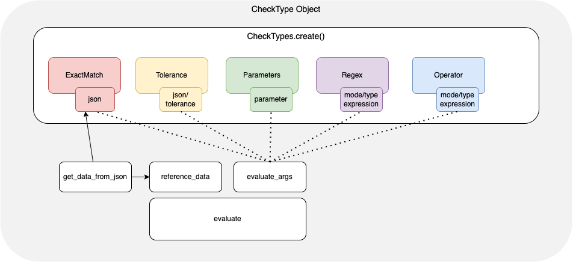

# Library Architecture

|  |
|:---:|
| **`jdiff` architecture** |

We use the `CheckType` factory class method `create` along with the specified check type to instantiate a concrete object of the specified `CheckType` class.

```python
from jdiff import CheckType, extract_data_from_json
check = CheckType.create("exact_match")
>>> <jdiff.check_types.ExactMatchType at 0x10a618e80>
```

- `exact_match`
- `tolerance`
- `parameter_match`
- `regex`
- `operator`


Next, load a JSON object as reference data. as well as a JMESPath expression to extract the values wanted and pass them to `extract_data_from_json` method. Be aware! `jdiff` works with a customized version of JMESPath. More on that [below](#customized-jmespath).

> We'll use data from the tests folder. We assume the current working directory is the root of the repo if you've cloned it.

```python
>>> bgp_reference_state = json.load(open("tests/mock/napalm_get_bgp_neighbors/pre.json"))
>>> bgp_jmspath_exp =  "global.$peers$.*.*.ipv4.[accepted_prefixes,received_prefixes,sent_prefixes]"
>>> bgp_reference_value = extract_data_from_json(bgp_reference_state, bgp_jmspath_exp)
```

Once the pre-change values are extracted, we would need to evaluate them against our post-change value. In the case of check-type `exact_match`, our post value would be another JSON object:

```python
>>> bgp_comparison_state = json.load(open("tests/mock/napalm_get_bgp_neighbors/post.json"))
>>> bgp_comparison_value = extract_data_from_json(bgp_comparison_state, bgp_jmspath_exp)
```

Each check type expects different types of arguments based on how and what they are checking. For example: check type `tolerance` needs a `tolerance` argument, whereas `parameter_match` expects a dictionary.

Now that we have pre and post data, we use the `evaluate` method to compare them, which will return our evaluation result.

```python
>>> check = CheckType.create(check_type="exact_match")
>>> results = check.evaluate(bgp_reference_value, bgp_comparison_value)
>>> results
({'10.1.0.0': {'accepted_prefixes': {'new_value': 900, 'old_value': 1000},
   'received_prefixes': {'new_value': 999, 'old_value': 1000},
   'sent_prefixes': {'new_value': 1011, 'old_value': 1000}}},
 False)
```


## Arguments

Generally, for all of the `CheckTypes`, the arguments will be in the order `intended state`, `actual state`, `options`. For instance, the time 1 state would be the first argument and time 2 state the second argument in the `exact_match` check type. 

For regex or parameter matching, your provided regex or dictionary would be the first argument and the collected data would be the second argument.

# Customized JMESPath

Since `jdiff` works with JSON objects as data inputs, JMESPath was the obvious choice for traversing the data and extracting the value(s) to compare. However, JMESPath has a limitation where context is lost for the values it collects, in other words, for each given value that JMESPath returns, we cannot be sure what key it was part of.

Below is the output of `show bgp`.

```python
>>> data = {
  "result": [
    {
      "vrfs": {
        "default": {
          "peerList": [
            {
              "linkType": "external",
              "localAsn": "65130.1100",
              "prefixesSent": 50,
              "receivedUpdates": 0,
              "peerAddress": "7.7.7.7",
              "state": "Idle",
              "updownTime": 1394,
              "asn": "1.2354",
              "routerId": "0.0.0.0"
            },
            {
              "linkType": "external",
              "localAsn": "65130.1100",
              "receivedUpdates": 0,
              "peerAddress": "10.1.0.0",
              "state": "Connected",
              "updownTime": 1394,
              "asn": "1.2354",
              "routerId": "0.0.0.0"
            }
          ]
        }
      }
    }
  ]
}
```
A JMESPath expression to extract `state` is shown below.

```python
>>> path = result[0].vrfs.default.peerList[*].state
```

...which will return

```python
>>> extract_data_from_json(data, path)
["Idle", "Connected"]
```

How can we understand that `Idle` is relative to peer 7.7.7.7 and `Connected` to peer `10.1.0.0`? 
We could index the output, but that would require some post-processing of the data. For that reason, `jdiff` uses a customized version of JMESPath where it is possible to define a reference key for the value(s) wanted. The reference key must be within `$` sign anchors and defined in a list, together with the value(s):

```python
>>> path = "result[0].vrfs.default.peerList[*].[$peerAddress$,state]"
```

That  would give us...

```python
>>> extract_data_from_json(pre,path)
[{'7.7.7.7': {'state': 'Idle'}}, {'10.1.0.0': {'state': 'Connected'}}]
```
