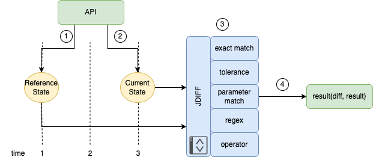

# jdiff

`jdiff` is a lightweight Python library allowing you to examine structured data. `jdiff` provides an interface to intelligently compare JSON data objects and test for the presence (or absence) of keys. You can also examine and compare corresponding key-values.

The library heavily relies on [JMESPath](https://jmespath.org/) for traversing the JSON object and finding the values to be evaluated. More on that [here](architecture.md#customized-jmespath).

## Getting Started


First, you import the `CheckType` class.

```python
from jdiff import CheckType
```

Get (or fabricate) some data. (This data may also be loaded from a file or from a string, more examples later.)

```python
a = {"foo": "bar"}
b = {"foo": "bar baz"}
```

Call the `create` method of the `CheckType` class to get an instance of the check type you want to perform.

```python
match = CheckType.create("exact_match")
```

Evaluate the check type and the diff.
```python
match.evaluate(a, b)
>>> ({'foo': {'new_value': 'bar baz', 'old_value': 'bar'}}, False)
```

This results in a tuple:
- The first value is the diff between the two data structures.
- The second value is a boolean with the result of the check.

This diff can also show whether any keys were added or deleted. 
The second value returned will be the boolean result of the check. In this case, the two data structures were not an exact match.


## Checking Data Structures

As shown in the example, the check evaluation both performs a diff and tests the objects. All of the concrete `CheckTypes` both perform the diff and their specified check.

More on the **check** part: The check provides a way to test some keys or values in our collected data. The check portion is focused on providing a boolean result of the test. There are a few different ways to check our data. 

Below are the names of checks provided by the library. These both describe the type of check performed against the data and are used as an argument to instantiate that type of check with the `create` method, e.g. `CheckType.create("check_type")`.

- `exact_match`: the keys and values must match exactly between the two objects
- `tolerance`: the keys must match and the values can differ according to the 'tolerance' value provided
- `parameter_match`: a reference key and value is provided and its presence (or absence) is checked in the provided object
- `regex`: a reference regex pattern is provided and is used to find a match in the provided object
- `operator`: similar to parameter match, but the reference includes several different possible operators: 'in', 'bool', 'string', and numerical comparison with 'int' and 'float' to check against

`CheckTypes` are explained in more detail in the [architecture](architecture.md).


## Workflow

|  |
|:---:|
| **`jdiff` Workflow** |


1. The reference state object is retrieved or assembled. The structured data may be from:

    - an API
    - another Python module/library
    - retrieved from a saved file
    - constructed programmatically

2. Some time passes where some change to the data may occur; then the comparison state is retrieved or assembled, often using a similar process used to get the reference state.
3. The reference state is then compared to the current state via the jdiff library using one of the `CheckTypes`.
4. The evaluate method is called on the `check` object, and the result is returned.

Please see [usage](usage.md) for commands and more information.
